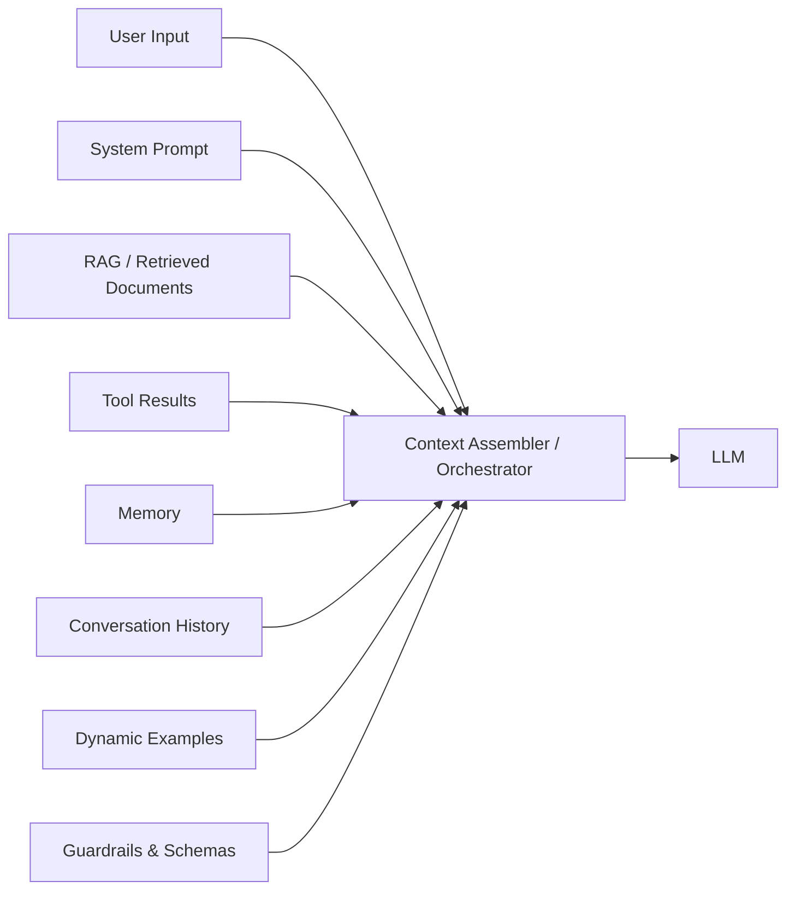

# Context Window Anatomy

## The Paradigm Shift

Prompt engineering (2022–2023) focused on crafting a **single text string** — choosing the right words, adding "think step by step," iterating on phrasing. Context engineering is the recognition that the entire input to an LLM is a **programmatically assembled artifact**, not a hand-written message.

| Aspect | Prompt Engineering | Context Engineering |
|---|---|---|
| **Input** | Single text string | Multi-source assembled context |
| **Approach** | Craft the perfect words | Design the information system |
| **Scale** | One prompt at a time | End-to-end pipeline |
| **Adaptability** | Static | Dynamic & responsive |
| **Skill** | Writing & intuition | Systems architecture |
| **Analogy** | Writing a good question | Building a research library |

> **Prompt engineering is one-dimensional. Context engineering is multi-dimensional.**

The core question shifts from *"What do I say to the model?"* to *"What does the model need to know?"*

---

## The Context Assembler / Orchestrator

In the context engineering paradigm, a **context assembler** sits between the user and the LLM. It pulls from multiple sources and assembles the full context:



This is the shift from manual prompt crafting to **automated orchestration**.

---

## Karpathy's OS Analogy

From Andrej Karpathy's YC talk *"Software in the Era of AI"*:

| Operating System | LLM System |
|---|---|
| CPU | The LLM model (Claude, GPT-4o, Gemini) |
| **RAM** | **Context window (128K–2M tokens)** |
| File System | Retrieval / RAG (vector DBs, documents) |
| System Calls | Tool / API calls (MCP, function calling) |
| Applications | Agents (autonomous task executors) |
| OS Kernel | System prompt (CLAUDE.md, base instructions) |

**Key insight: Your core job as a context engineer is managing what's in the context window — the LLM's RAM.** The LLM can only reason about what it can see. Everything else (RAG, tools, memory) exists to get the right information into that window at the right time.

---

## The 6 Elements of the Context Window

Everything inside the context window falls into one of six layers:

| # | Element | Description | Example Budget |
|---|---|---|---|
| 1 | **System Instructions** | Role definition, safety rules, output format, persona | ~2,000 tokens |
| 2 | **User Input** | The current query or task | ~500 tokens |
| 3 | **Conversation History** | Prior Q&A turns, reasoning chains | ~10,000 tokens |
| 4 | **Retrieved Knowledge (RAG)** | Chunked documents, embeddings search results | ~8,000 tokens |
| 5 | **Tool Definitions & Results** | Available functions + outputs from prior calls | ~5,000 tokens |
| 6 | **State & Memory** | Persistent facts, scratchpads, user preferences | ~3,000 tokens |

**Total example budget: ~28,500 tokens** out of a 128K window — leaving ~100K for generation and headroom.

> Prompt Engineering = Element #2 only. **Context Engineering = All 6 elements.**

### Priority & Persistence

- System instructions are **always present** and highest priority
- Conversation history is managed — older turns get **compressed or dropped**
- RAG results are scored by relevance (similarity scores like 0.92, 0.87, 0.81)
- Tool results are ephemeral — present only when relevant
- Memory persists across sessions

### Token Budget as a Constraint

The context window is a **fixed budget** (e.g., 128K tokens). You must allocate tokens across these 6 layers like you allocate RAM across processes:

```
Total tokens = past conversation + current input + upcoming output
```

If `input tokens + expected output tokens > limit`, the API will reject the request. In chat systems, the system must either:

- Drop older messages (most common)
- Summarize earlier content into fewer tokens
- Reject the request

---

## Context Rot

Two distinct failure modes when context grows:

- **Context overflow** — exceeding the maximum token limit. Uncommon, easy to detect.
- **Context rot** — performance degradation *within* the allowed limit. **Common and insidious.**

### The "Lost in the Middle" Effect

Research from [Liu et al., 2023](https://arxiv.org/abs/2307.03172) shows a U-shaped attention curve:

- **Primacy effect** (start) — models attend strongly to system prompts and first instructions
- **Recency effect** (end) — models attend strongly to the latest messages
- **Lost in the middle** — critical information placed in the middle of long context gets **missed**

```
Attention
Strength
    High ┤  ╭──╮                        ╭──╮
         │ ╭╯  ╰──╮                  ╭──╯  ╰╮
         │╭╯      ╰──╮          ╭────╯       ╰╮
    Low  ┤╯           ╰──────────╯             ╰
         └──────────────────────────────────────
         Start       Middle              End
                Position in Context
```

> *"Find the smallest set of high-signal tokens that maximize the likelihood of your desired outcome."* — Anthropic

### Practical Implications

1. Put critical instructions at the **start** (system prompt) and **end** (near current query)
2. Don't dump massive documents in the middle hoping the model finds the needle
3. **Shorter, targeted context often outperforms longer context** with more information
4. Compression and selective retrieval matter — not just for fitting in the window, but for **attention quality**

---

## Key Takeaway

Context engineering is to prompt engineering what systems programming is to scripting. You're not writing prompts — you're building the **infrastructure** that selects, compresses, and arranges the right information into the context window so the model can do its best work.

This is directly relevant to **ctxguard** — the tool exists because context bloat and rot are real engineering problems that degrade AI agent performance.
